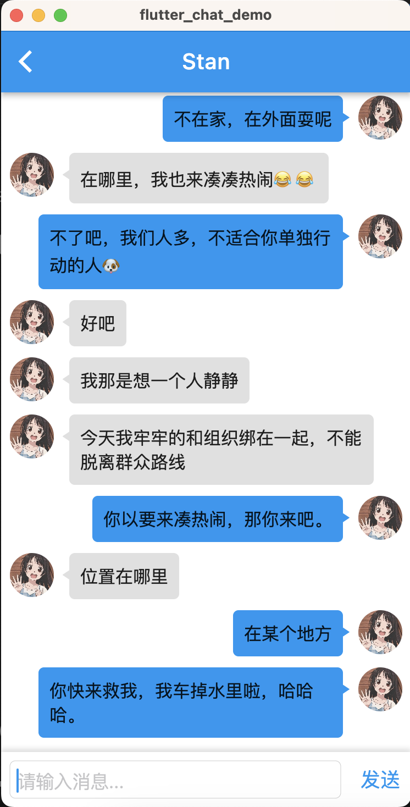

# chat-demo-flutter

这是一个用 Flutter 编写的聊天 demo 应用，使用 Dart 作为后端，聊天交互使用 WebSocket。

## 快速使用 

1. git clone ...
2. flutter pub get
3. 找到 `./lib/tools/net_service/net_provider.dart` 文件中的 `host` 静态变量，修改成你自己的 IP 地址
4. 如果需要打包成 APK 需要签名文件 key.jks

    ```shell
    keytool -genkeypair -v -keystore key.jks -storetype JKS -keyalg RSA -keysize 2048 -validity 10000 -alias my-key-alias
    ```

>注意： 这个项目需要配合服务端使用

服务端项目地址: <https://github.com/LiliCode/chat-server-demo>

## 示例图片

